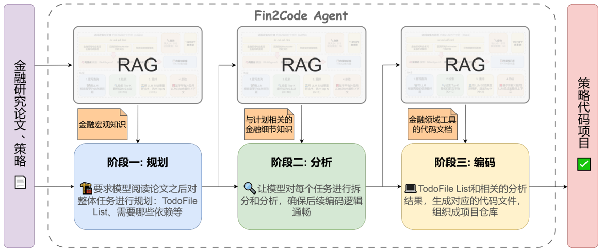
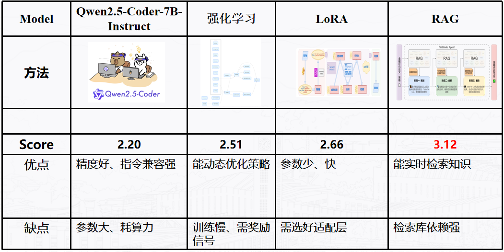

# Financial Strategy Code Generator

一个基于大语言模型的智能金融策略代码生成系统，能够自动分析金融论文、设计交易策略架构并生成可执行的Python代码。

## 🎯 项目概述

FinancialStrategy2Code 是一个端到端的AI驱动系统，专门用于将金融研究论文转化为可执行的交易策略代码。系统采用三阶段流水线架构：

1. **策略规划阶段** - 深度解析金融论文，提取核心算法和实验设计
2. **策略分析阶段** - 设计软件架构，分析代码依赖关系
3. **代码生成阶段** - 自动生成完整的、可运行的Python代码



### 核心特性

- 🤖 **智能论文解析** - 支持JSON和LaTeX格式的金融论文输入
- 🏗️ **自动架构设计** - 基于论文内容自动设计软件架构
- 📊 **完整代码生成** - 生成包含数据加载、策略实现、回测引擎的完整代码
- 🎨 **Web界面** - 提供直观的Web界面进行策略生成和管理
- 📚 **知识库支持** - 集成向量数据库，支持策略知识检索
- 🔧 **多模型支持** - 支持多种LLM模型（DeepSeek、OpenAI等）

## 🚀 快速开始

### 环境要求

- Python 3.8+
- Go 1.19+ (用于Web服务)
- Node.js 16+ (用于前端界面)

### 安装步骤

1. **克隆仓库**
```bash
git clone https://github.com/ZhijiangTang/FinancialStrategy2Code
cd FinancialStrategy2Code
```

2. **安装Python依赖**
```bash
pip install -r requirements.txt
```

3. **配置API密钥**
```bash
# 在api_key目录下创建配置文件
export OPENAI_API_KEY="your-api-key"
export BASE_URL="https://api.siliconflow.cn/v1"
```

4. **启动Web服务**
```bash
# 编译Go服务
cd agent/server
go build -o app.exe main.go
./app.exe

# 启动前端界面
cd ../client
npm install
npm run dev
```

### 使用示例

1. **准备论文文件**
   - 将PDF论文转换为JSON格式（推荐）或LaTeX格式
   - 放置在`examples`目录下

2. **运行策略生成**
```bash
cd scripts
# 修改run.sh中的配置参数
bash run.sh
```

3. **查看生成结果**
   - 生成的代码位于`outputs/{paper_name}_repo/`目录
   - 包含完整的项目结构和可执行代码

## 🏗️ 系统架构

### 核心模块

```
FinancialStrategy2Code/
├── codes/                    # 核心代码生成模块
│   ├── 1_planning.py        # 策略规划 - 解析论文，制定实现计划
│   ├── 1.1_extract_config.py # 配置提取 - 从规划中提取配置参数
│   ├── 2_analyzing.py       # 策略分析 - 设计软件架构和依赖关系
│   ├── 3_coding.py          # 代码生成 - 生成完整的Python代码
│   ├── utils.py             # 工具函数 - 通用功能和辅助方法
│   └── rag_handler.py       # RAG处理器 - 知识检索增强生成
├── agent/                   # Web服务模块
│   ├── server/              # Go后端服务
│   ├── client/              # Vue.js前端界面
│   └── model/               # 模型定义
├── corpus/                  # 知识库文档
├── examples/                # 示例论文和策略
├── outputs/                 # 生成结果输出
├── prompts/                 # 提示词模板
└── scripts/                 # 运行脚本
```


## 📋 详细功能说明

### 1. 策略规划模块 (`1_planning.py`)

**功能**: 深度解析金融论文，制定详细的实现计划

**核心特性**:
- 支持JSON和LaTeX格式的论文输入
- 自动提取论文中的方法论、实验设置、超参数
- 生成详细的实现路线图
- 设计软件系统架构

**输出文件**:
- `planning_trajectories.json` - 规划轨迹记录
- `planning_config.yaml` - 提取的配置参数
- `task_list.json` - 任务分解列表

### 2. 策略分析模块 (`2_analyzing.py`)

**功能**: 基于规划结果设计软件架构，分析代码依赖关系

**核心特性**:
- 生成详细的类图和接口设计
- 分析模块间的依赖关系
- 制定代码实现逻辑
- 确定第三方包依赖

**输出文件**:
- `analyzing_artifacts/` - 分析结果文件
- `*_simple_analysis_response.json` - 各模块分析结果

### 3. 代码生成模块 (`3_coding.py`)

**功能**: 自动生成完整的、可执行的Python代码

**核心特性**:
- 生成符合Google代码规范的Python代码
- 自动处理导入语句和依赖关系
- 实现完整的项目结构
- 包含配置管理、错误处理、日志记录

**生成的文件结构**:
```
{paper_name}_repo/
├── main.py              # 主程序入口
├── config.py            # 配置管理
├── data_loader.py       # 数据加载器
├── strategy.py          # 策略实现
├── backtest_engine.py   # 回测引擎
├── results_analyzer.py  # 结果分析器
├── config.yaml          # 配置文件
└── requirements.txt     # 依赖包列表
```

### 4. Web服务模块 (`agent/`)

**功能**: 提供Web界面进行策略生成和管理

**技术栈**:
- **后端**: Go + Gin框架
- **前端**: Vue.js + Element Plus
- **通信**: RESTful API

**核心功能**:
- 文件上传和管理
- 策略生成进度跟踪
- 结果预览和下载
- 历史记录管理

### 5. 知识库模块 (`build_knowledge_base.py`)

**功能**: 构建向量知识库，支持RAG增强生成

**核心特性**:
- 支持PDF、TXT、MD、HTML格式文档
- 使用FAISS进行向量索引
- 集成BGE-M3嵌入模型
- 支持批量处理和增量更新

## 🔬 实验与评估

### 实验设置

系统已在多个经典金融策略上进行了测试：

1. **海龟交易系统 (Turtle Trading)**
   - 论文来源: 《Way of the Turtle》
   - 生成代码: 完整的回测系统，包含趋势跟踪、仓位管理
   - 评估指标: 夏普比率、最大回撤、胜率

2. **动量策略 (Momentum Strategy)**
   - 论文来源: 学术论文
   - 生成代码: 多因子动量模型
   - 评估指标: 收益率、风险调整收益

3. **Transformer模型在金融中的应用**
   - 论文来源: 深度学习论文
   - 生成代码: 基于Transformer的价格预测模型
   - 评估指标: 预测准确性、模型性能

### 性能评估



### 最佳实践

1. **论文准备**
   - 确保论文包含完整的方法论描述
   - 明确实验参数和评估指标
   - 提供数据格式和来源信息

2. **配置优化**
   - 根据论文复杂度调整模型参数
   - 设置合适的超参数范围
   - 配置适当的计算资源

3. **结果验证**
   - 检查生成代码的完整性
   - 验证策略逻辑的正确性
   - 进行回测验证和性能分析

## 🤝 贡献指南

欢迎贡献代码和想法！

1. Fork 项目
2. 创建功能分支 (`git checkout -b feature/AmazingFeature`)
3. 提交更改 (`git commit -m 'Add some AmazingFeature'`)
4. 推送到分支 (`git push origin feature/AmazingFeature`)
5. 打开 Pull Request


---

**注意**: 本系统生成的策略代码仅供学习和研究使用，实际交易请谨慎评估风险并遵守相关法规。
